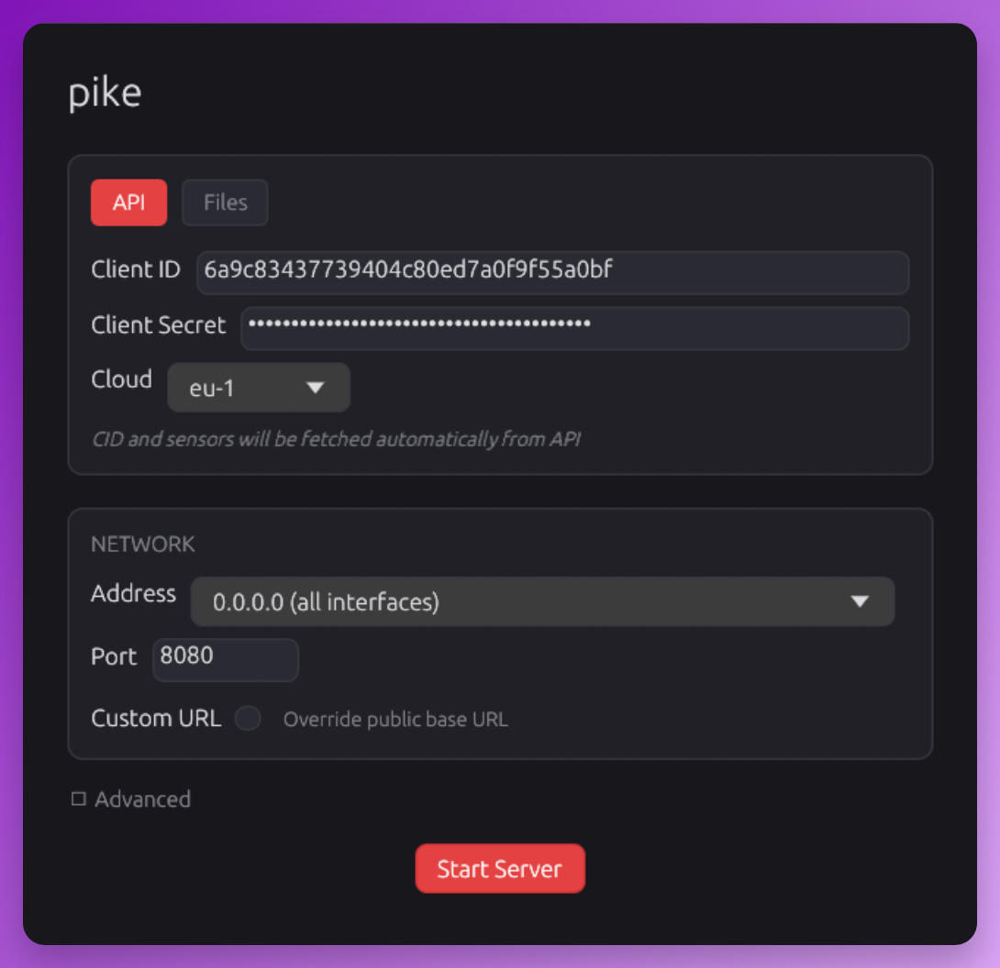
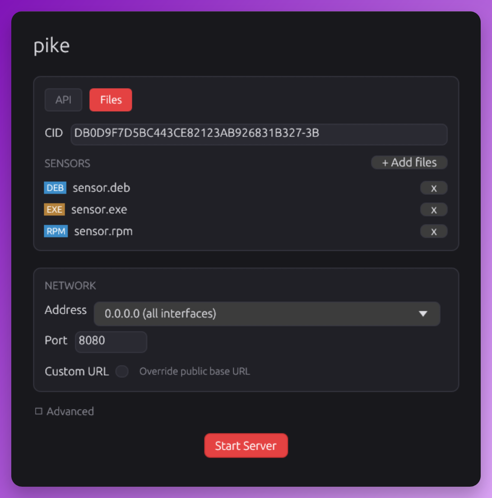
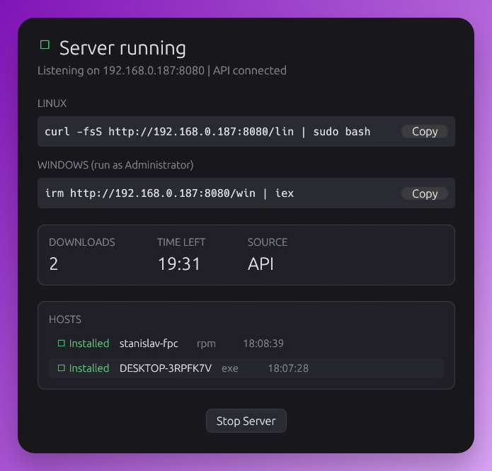

# Pike

CrowdStrike Falcon sensor deployment tool. Serves installation scripts and sensor binaries over HTTP so target hosts can install with a single command. Supports local sensor files and on-demand retrieval from the CrowdStrike API.

Works on Linux (deb/rpm) and Windows (exe). Has both CLI and GUI modes.

## Screenshots

| Main screen | Files mode | Running server |
|---|---|---|
|  |  |  |

## Build

Requires Rust 2024 edition.

```
cargo build --release
```

Binary: `target/release/pike`

## Usage

### GUI mode

Starts automatically when no CLI arguments are provided:

```
pike
```

Or explicitly:

```
pike gui
```

### Server mode

```
pike serve --sensor ./falcon-sensor.deb --cid <CID>
```

With CrowdStrike API (sensors fetched on demand):

```
pike serve --client-id <ID> --client-secret <SECRET> --cid <CID> --cloud us-1
```

The API client only needs the **Sensor Download** scope with **Read** permission.

### Flags

| Flag | Description |
|---|---|
| `--config <PATH>` | Config file (default: `/etc/pike/pike.toml` if it exists) |
| `--sensor <PATH>` | Local sensor file(s), can be specified multiple times |
| `--cid <CID>` | CrowdStrike Customer ID (env: `PIKE_CID`) |
| `--client-id <ID>` | API Client ID (env: `PIKE_CLIENT_ID`) |
| `--client-secret <SECRET>` | API Client Secret (env: `PIKE_CLIENT_SECRET`) |
| `--cloud <CLOUD>` | Cloud region: us-1, us-2, eu-1, us-gov-1, us-gov-2 |
| `--addr <ADDR>` | Advertised address for one-liners (auto-detected) |
| `--public-url <URL>` | External URL when running behind a reverse proxy |
| `--port <PORT>` | HTTP port (default: 8080) |
| `--bind <ADDR>` | Bind address (default: 0.0.0.0) |
| `--token <TOKEN>` | Pin the auth token so the one-liner survives restarts (env: `PIKE_TOKEN`) |
| `--timeout <MIN>` | Shut down after N minutes, 0 = never (default: 0) |
| `--max-downloads <N>` | Shut down after N downloads, 0 = unlimited |
| `--cache-dir <PATH>` | Sensor cache directory |
| `--metadata-ttl <MIN>` | How long the API sensor list stays fresh (default: 60) |
| `--cache-max-bytes <N>` | Cache size limit (default: 20 GiB) |
| `--tags <TAGS>` | Sensor grouping tags, comma-separated |
| `--no-default-tag` | Drop the automatic `deployment/pike` tag |
| `--no-auth` | Disable token authentication |

### Config file

Values are resolved as **flags > environment > config file > defaults**. Every key
is optional.

```toml
[server]
bind = "0.0.0.0"
port = 8080
addr = "10.0.0.5"              # advertised in one-liners; auto-detected if omitted
public_url = ""                # e.g. https://pike.lab.local behind a proxy
token = "labtoken0123456789"   # pin it, or the one-liner URL changes on restart
timeout_minutes = 0            # 0 = run forever
max_downloads = 0              # 0 = unlimited

[falcon]
client_id = ""
client_secret = ""
cloud = "eu-1"
cid = ""

[sensors]
cache_dir = "/var/cache/pike"
metadata_ttl_minutes = 60
cache_max_bytes = 21474836480  # 20 GiB
tags = "lab/crowdstrike"
default_tag = true
files = []                     # local sensor files, same as --sensor
```

Secrets can stay out of both argv and the config file via `PIKE_CLIENT_ID`,
`PIKE_CLIENT_SECRET`, `PIKE_CID` and `PIKE_TOKEN`.

### Long-lived operation

With `timeout_minutes = 0` and a pinned token, pike can be left running: the
one-liner never changes, the API sensor list is re-queried every
`metadata_ttl_minutes` so new sensor versions get picked up without a restart,
and downloaded binaries are cached on disk by sha256 with size-based eviction.
If the CrowdStrike API becomes unreachable, pike keeps serving the last known
sensor list and whatever is already in the cache.

## One-liners

After starting, pike prints ready-to-use commands:

Linux:
```
curl -fsS http://<server>:<port>/<token>/lin | sudo bash
```

Windows (run as Administrator):
```
irm http://<server>:<port>/<token>/win | iex
```

Without auth (`--no-auth`), the `/<token>` prefix is omitted.

## Updating

Check for updates:

```
pike update
```

Download and install the latest version:

```
pike update --apply
```

Pike also checks for updates automatically on startup — in server mode a notice is shown in the banner, in GUI mode an update banner appears on the config screen.

## How it works

1. Pike starts an HTTP server and serves installation scripts
2. A target host fetches the script and executes it
3. The script calls back to pike with hostname, package type, architecture, and distro info
4. Pike matches the best sensor — explicitly provided local files first, otherwise the freshest API metadata — and responds with filename + SHA256
5. The script downloads the sensor, verifies the checksum, installs it, and reports back

## HTTP endpoints

| Path | Method | Description |
|---|---|---|
| `/lin` | GET | Linux bash install script |
| `/win` | GET | Windows PowerShell install script |
| `/s/{sha256}` | GET | Sensor binary download |
| `/cb` | POST | Host callback (registration + sensor matching) |
| `/done` | POST | Installation result report |

All paths are optionally prefixed with `/<token>` when auth is enabled.

## Sensor matching

RPM sensors are matched by distro tag and architecture from the filename (e.g. `.el9.x86_64.rpm`). RHEL-family distros (Fedora, Rocky, Alma, Oracle, CentOS) use a fallback chain when an exact match is unavailable. DEB sensors are matched by architecture only since the same binary works across Ubuntu and Debian. Windows uses a single multi-arch installer.

## Project structure

```
src/
  main.rs           Entry point, subcommands (serve/gui/update)
  config.rs         Flags, env and TOML config merging
  types.rs          Core types (AppState, Sensor, HostEntry)
  sensor_match.rs   Distro/arch matching logic
  sensor_store.rs   API metadata cache + sha256-keyed binary cache
  scripts.rs        Install script generation
  falcon_api.rs     CrowdStrike API client
  util.rs           Sensor loading, token generation
  server/           HTTP server (axum)
  gui/              GUI (egui/eframe)
templates/
  linux.sh          Bash install template
  windows.ps1       PowerShell install template
```

## Tests

```
cargo test
```

## License

[MIT](LICENSE)
